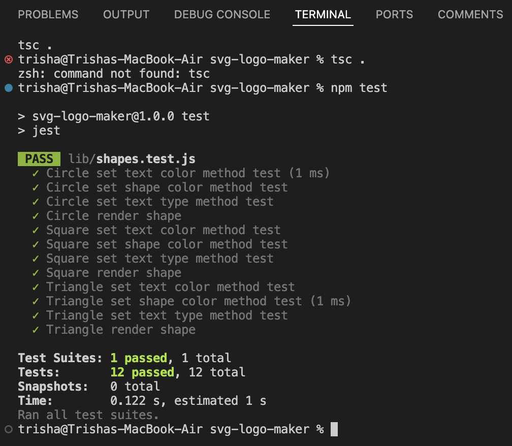

# 🏁 SVG Logo Maker 

[](https://github.com/trishamasbate)
[](https://choosealicense.com/licenses/mit/)


## 📃 Description:
This SVG Logo Generator command-line application aims to exceed expectations by providing a seamless user experience, robust functionality, thorough testing, and comprehensive documentation. The walkthrough video serves as a visual guide to showcase the application's capabilities, ensuring users can confidently utilize and customize their logo designs with ease.

By focusing on usability, reliability, and educational resources, the application aims to empower users to create professional SVG logos efficiently and effectively using Node.js.


## 📌 Table of Contents
- [🏁 SVG Logo Maker](#-svg-logo-maker)
  - [📃 Description:](#-description)
  - [📌 Table of Contents](#-table-of-contents)
  - [🔎 User Story](#-user-story)
  - [✅ Acceptance Criteria](#-acceptance-criteria)
  - [💡 Usage Instructions](#-usage-instructions)
  - [🎞️ Walkthrough Video:](#️-walkthrough-video)
  - [📸 Screenshots:](#-screenshots)
    - [🟢 Terminal/Command Line Application](#-terminalcommand-line-application)
    - [🟢 NPM Test through Jest](#-npm-test-through-jest)
    - [🟢 Generated SVG Logo](#-generated-svg-logo)
  - [📲 Installation Process](#-installation-process)
  - [🗝️ Resources](#️-resources)
  - [❓ Questions](#-questions)
  - [🪪 License](#-license)

## 🔎 User Story
```md
AS a freelance web developer
I WANT to generate a simple logo for my projects
SO THAT I don't have to pay a graphic designer
```

## ✅ Acceptance Criteria
```md
GIVEN a command-line application that accepts user input
WHEN I am prompted for text
THEN I can enter up to three characters
WHEN I am prompted for the text color
THEN I can enter a color keyword (OR a hexadecimal number)
WHEN I am prompted for a shape
THEN I am presented with a list of shapes to choose from: circle, triangle, and square
WHEN I am prompted for the shape's color
THEN I can enter a color keyword (OR a hexadecimal number)
WHEN I have entered input for all the prompts
THEN an SVG file is created named `logo.svg`
AND the output text "Generated logo.svg" is printed in the command line
WHEN I open the `logo.svg` file in a browser
THEN I am shown a 300x200 pixel image that matches the criteria I entered
```

## 💡 Usage Instructions
1.	Locate and navigate to the directory that contains the `index.js` file within your editor.
2.	Launch an integrated terminal directly from your editor and execute the command `node index.js`.
3.	Engage with the command-line interface facilitated by npm's inquirer package. Progress through each prompt in sequence, providing responses as required.
4.	Upon successfully completing the prompts, an SVG file named `logo.svg` will be automatically generated.
5.	If desired, you have the option to rename the `logo.svg` file to better align with your preferences.


## 🎞️ Walkthrough Video:
[Click TO WATCH SOME MAGIC!]()

## 📸 Screenshots:
### 🟢 Terminal/Command Line Application
 
### 🟢 NPM Test through Jest

### 🟢 Generated SVG Logo


## 📲 Installation Process
1. Clone the repository: [SVG Logo Maker](https://github.com/Thecaprifire/logo-folio)
2. Install the following: 
   - Node.JS [Version 20.14.0](https://nodejs.org/en/blog/release/v20.14.0/) 
   - Jest [Version 24.9.0](https://www.npmjs.com/package/jest)
   - Inquirer.js: [Version 8.2.4](https://www.npmjs.com/package/inquirer/v/8.2.4)
3. Open the cloned repository in any source code editor.
4. Open the integrated terminal for the document and complete the respective installation guides provided above in section (2.) to ensure the cloned documentation will operate.


## 🗝️ Resources
- Dynamic JavaScript
- Node.JS [Version 20.14.0](https://nodejs.org/en/blog/release/v20.14.0/)
- Jest [Version 24.9.0](https://www.npmjs.com/package/jest)
- Inquirer.js: [Version 8.2.4](https://www.npmjs.com/package/inquirer/v/8.2.4)
- License Badge: [Shields.io](https://shields.io/)
- Visual Studio Code: [Website](https://code.visualstudio.com/)


## ❓ Questions
Contact the author with any questions!<br>
Github link: [trishamasbate](https://github.com/trishamasbate)<br>
Email: trisha.masbate@gmail.com

## 🪪 License
This project is [MIT](https://choosealicense.com/licenses/mit/) licensed.<br />

Copyright © 2024 [TRISHA MASBATE](https://github.com/trishamasbate)
  
<hr>
<p align='center'><i>
All the best! 🤟🏻 TRISHA MASBATE
</i></p>
  
